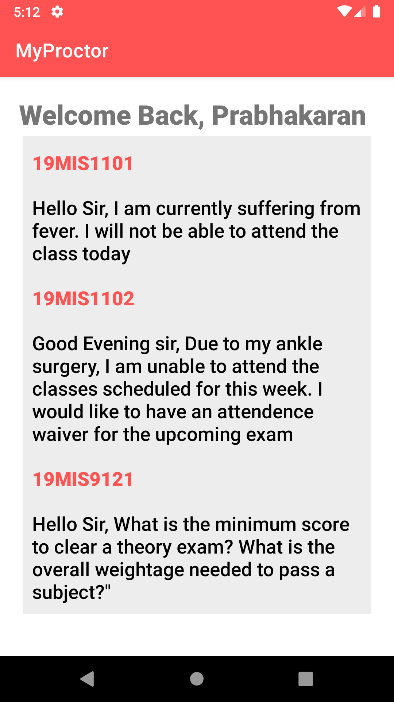

# MyProctor | Digiral Proctoring System

### MyProctor is a digital proctoring system designed for universities

## Introduction

A proctor is an officer at universities, appointed annually and having mainly disciplinary functions. Members of the teaching faculty can be appointed as proctors to ensure the welfare of the students. According to the National Crime Record Bureau (NCRB), in 2020,
Every 42 minutes, a student committed suicide; that is, more than 34 students died by suicide every day. A proctor can ensure their welfare, needs, and mental health on the university campus.

## Unique Selling Point (USP)

The application is designed to handle a large number of queries sent by the proctor. Firebase helps in scaling the application to a wide range of proctors and students. The application provides peak performance and availability for timely requests. The application ensures that the proctor is available for their allocation students anytime and helps reduce the need to install multiple digital platforms.

## Key features

1. The application has two login stakeholders, namely student and proctor
2. Students can send short messages of up to 200 characters
3. The faculty gets a list-based view of the students messages
4. The faculty gets notified when a student sends a message

## Tech Stack

| Module         | Technology                  |
| :------------- | :-------------------------- |
| Frontend       | Android                     |
| Business Logic | Java                        |
| Database       | Firebase Real-time database |

## Application Workflow

### 1. Students log into the digital proctoring system with their student ID and password

### 2 . Students can glance their information and their proctor's information and can send messages to their proctors

### 3. Proctors can login to the system using the faculty ID and password

### 4. The proctor can view the list of queries posed by their student

